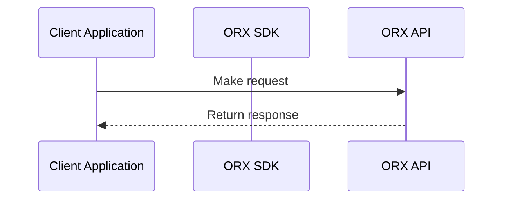

# ORX API v5 Documentation Conventions Guide

This document outlines all conventions used across the ORX API v5 documentation to ensure consistency when creating new documentation or updating existing content.

## 1. Endpoint Definition Patterns

### URL Structure Conventions
- **Pattern**: `METHOD /resource/[parameter]/sub-resource`
- **Session-based**: Most endpoints use `[sessionId]` as primary route parameter
- **Indexed resources**: Use descriptive parameter names: `[boundIndex]`, `[passengerPublic]`, `[seatId]`, `[paymentId]`
- **Hierarchical nesting**: Resources nested logically (flights > bounds > segments > seats)

### HTTP Method Usage
- **GET**: Retrieve data (search results, session info, pricing, lists)
- **POST**: Create/initiate operations (search, order, seat selection, payment initiation)
- **PUT**: Update existing resources (passenger info, payment info)
- **DELETE**: Remove resources (seats, payments)

### Endpoint Examples
```
GET /flight/[sessionId]/bound/[boundIndex]
POST /flight/[sessionId]/order
PUT /passenger/[sessionId]/[passengerPublic]
DELETE /flight/[sessionId]/seat/[seatId]
GET /session/[sessionId]
POST /payment/[sessionId]/initiate
```

## 2. TypeScript Type System & Glossary Integration

### Type Definition Style
- **Pseudo-TypeScript**: Clear, readable interface definitions with explicit type annotations
- **Optional Properties**: Always marked with `?` suffix
- **Union Types**: Used extensively for enums, status codes, and multiple allowed values
- **Complex Nesting**: Detailed nested object structures with clear property documentation
- **Descriptive Comments**: Each property includes description of purpose and format

### Cross-Reference Pattern
- **Link Format**: `[Type Name](/versions/v5/glossary#anchor-name)`
- **Anchor Format**: kebab-case anchors for all types (e.g., `#passenger-information`)
- **Bidirectional Links**: Types reference each other extensively
- **Context Awareness**: Links include version in path for future-proofing

### Type Definition Template
```typescript
interface ExampleType {
  required_field: string;
  optional_field?: string;
  enum_field: "VALUE1" | "VALUE2" | "VALUE3";
  nested_object: {
    sub_field: number;
    optional_sub?: boolean;
  };
  reference_field: ReferencedType;
  array_field: Array<string>;
}
```

### Glossary Organization
- **Alphabetical within categories**: Related types grouped together
- **Inheritance patterns**: Base types defined before extensions
- **Examples included**: Each type has JSON example showing actual usage
- **Validation rules**: Specific format requirements documented

## 3. Example Data Conventions

### Code Block Formatting
```json filename="POST /flight/[sessionId]/order" copy
{
  "example": "data"
}
```
- **Copy Attribute**: All JSON examples include `copy` for clipboard functionality
- **Filename Attribute**: Shows endpoint path for context
- **Language Specification**: Always specify language (`json`, `ts`, `shell`, `mermaid`)

### Data Standards
- **Currency**: Primarily CAD (Canadian Dollar) with amount as strings
- **Airports**: Canadian airport codes (YVR, YYZ, YUL, YYC, etc.) for consistency
- **Dates**: ISO8601 format (`2023-07-24T21:55:00` or `2023-07-24 21:55:00`)
- **Public IDs**: Always UUIDs (e.g., `"77553c48-6ecf-41ba-a4fa-ba48418aebf2"`)
- **Phone Numbers**: E.164 format (`+16023033033`)
- **Amounts**: Always strings, never numbers, with decimal precision

### Realistic Example Data
- **Names**: Use realistic but generic names (John Doe, Jane Doe)
- **Addresses**: Canadian addresses with proper postal codes
- **Airlines**: Mix of major carriers (Air Canada, WestJet, Porter)
- **Flight Numbers**: Realistic airline-specific patterns
- **Prices**: Reasonable real-world pricing

## 4. Call-out Patterns & Visual Indicators

### Icon-Based Call-outs
- **🛎 (Bell)**: General tips, recommendations, additional helpful information
- **🧨 (Bomb)**: Critical warnings, breaking changes, important constraints that could cause issues
- **🔔 (Notification)**: Configuration notes, setup requirements, administrative details
- **💣 (Explosive)**: Dangerous operations, potential data loss, irreversible actions
- **⛳ (Flag)**: Optional features, preference headers, customizable behavior

### Call-out Usage Guidelines
```markdown
> 🛎 You do not need to send all information at once. Multiple calls are supported.

> 🧨 Once the order is placed, **the search session will be invalidated**.

> ⛳ By default, session expirations are dynamic, but you can request static 2-hour windows with `Prefer: dynamic-session-expiry=false`.
```

### When to Use Each Type
- **🛎**: Best practices, optimization tips, workflow suggestions
- **🧨**: Breaking changes, session invalidation, required sequences
- **🔔**: Environment setup, configuration requirements
- **💣**: Data deletion, cancellation, permanent changes
- **⛳**: Optional parameters, preference headers, feature flags

## 5. Error Documentation Standards

### Error Table Format
```markdown
| Status Code | Error | Reason | Reason Code |
|---|---|---|---|
| 400 | [Validation Error] | Failed Validation | ORX_VALIDATION_EXCEPTION |
| 404 | Session not found or expired | Request targeting a non-existent session | ORX_SESSION_NOT_FOUND |
```

### Error Code Conventions
- **ORX_** prefix for all custom error codes
- **Descriptive names**: `ORX_SESSION_LOCKED`, `ORX_PAYMENT_AUTHORIZATION_FAILED`
- **Standard HTTP codes**: 400 (validation), 404 (not found), 409 (conflict), 412 (precondition failed)
- **Consistent messaging**: Similar errors use similar language across endpoints

### Error Documentation Requirements
- **Status Code**: HTTP status number
- **Error Message**: Human-readable error text
- **Reason**: Explanation of what caused the error
- **Reason Code**: Machine-readable error identifier (when available)

## 6. Cross-Flow Concepts & Shared Components

### Session Management Pattern
- **Universal Context**: SessionId required for most operations after initial search
- **Expiration Handling**: All responses include `expireAt` timestamps
- **Flow Types**: 
  - `FLIGHT`: Active search sessions (short-lived, ~2 hours)
  - `FLIGHT_BOOKING`: Order sessions (long-lived, until travel date)
- **Session Transitions**: Search sessions become booking sessions after order

### Fraud Prevention Integration
- **SDK Pattern**: Browser SDK (`@ndcsol/orx`) handles sensitive operations
- **Context Creation**: `createContext()` method generates fraud prevention data
- **3D Secure Flow**: 
  1. Order triggers 3DS requirement
  2. SDK processes authentication
  3. Result attached to subsequent order request
- **Risk Evaluation**: Post-order risk assessment included in response

### Passenger Management
- **Session-Scoped**: Passengers exist within session context
- **Public ID System**: UUIDs for cross-endpoint referencing
- **Incremental Updates**: Support partial information updates via multiple PUT calls
- **Validation Requirements**: Complete `personal_info` required before pricing

### Payment Processing
- **TokenEx Integration**: Secure card tokenization workflow
- **Alternative Methods**: Support for non-card payments (Verto, others)
- **Progressive Building**: Payment info built incrementally before order
- **Session Attachment**: Payments can be attached to session or provided in order

## 7. Visual Documentation Patterns

### Mermaid Diagram Conventions


### Diagram Types Used
- **Sequence Diagrams**: For API interaction flows
- **Flow Charts**: For decision trees and process flows
- **Entity Relationship**: For data structure relationships

### Diagram Standards
- **Descriptive Labels**: Clear participant and action names
- **Consistent Styling**: Standard arrow types and formatting
- **Real-world Context**: Use actual endpoint names and data

## 8. Documentation Structure Patterns

### Standard Page Organization
1. **Page Title & Introduction**: Clear purpose statement
2. **Prerequisites/Requirements**: What needs to be done first
3. **Main Operations**: Primary endpoint documentation
   - Request format
   - Response format
   - Example data
4. **Advanced Usage**: Optional advanced features
5. **Error Reference**: Comprehensive error table

### Section Naming Conventions
- **Gerund Forms**: "Requesting Order", "Selecting Flights", "Managing Passengers"
- **Action-Oriented**: Focus on what the user is doing
- **Hierarchical**: Clear nesting with appropriate heading levels

### Content Flow Pattern
1. **Context Setting**: Explain when/why to use this endpoint
2. **Request Documentation**: Payload structure and examples
3. **Response Documentation**: Expected response format
4. **Error Handling**: Possible errors and resolution

## 9. Data Validation & Constraint Documentation

### Validation Documentation Pattern
```markdown
- `field_name`: (`type`) Description of field purpose
  - Validation: Specific format requirements
  - Example: `"example_value"`
```

### Constraint Types
- **Format Validation**: Regex patterns, length limits
- **Business Rules**: Cross-field dependencies, workflow requirements
- **External Standards**: IATA codes, ISO formats, currency codes

### Validation Table Format
```markdown
| Field | Type | Validation | Required |
|-------|------|------------|----------|
| `email` | string | Valid email format | Yes |
| `phone_number` | string | E.164 format | Yes |
```

## 10. Content Writing Guidelines

### Tone & Voice
- **Professional but approachable**: Technical accuracy with clarity
- **Action-oriented**: Focus on what users need to do
- **Assumption of competence**: Don't over-explain basic concepts
- **Helpful warnings**: Alert users to potential issues proactively

### Technical Writing Standards
- **Present tense**: "The API returns..." not "The API will return..."
- **Active voice**: "Call the endpoint" not "The endpoint should be called"
- **Specific examples**: Real data rather than placeholder values
- **Complete examples**: Show full request/response cycles

### Consistency Requirements
- **Terminology**: Use same terms throughout (e.g., "session ID" not "session identifier")
- **Parameter naming**: Consistent naming across all endpoints
- **Format standards**: Same date/time/currency formats everywhere

## 11. Version-Specific Considerations

### v5 Specific Features
- **Hotel Integration**: New hotel booking capabilities alongside flights
- **Enhanced Fraud Prevention**: Advanced SDK integration and 3DS
- **Webhook System**: Event-driven notifications for booking status
- **Commission Details**: Detailed commission calculation information

### Future-Proofing Guidelines
- **Version in URLs**: Always include `/versions/v5/` in links
- **Deprecation Patterns**: How to mark features as deprecated
- **Migration Notes**: When referencing changes from previous versions

## 12. Quality Assurance Checklist

### Before Publishing Documentation
- [ ] All code examples include `copy` attribute
- [ ] All endpoints show proper HTTP method
- [ ] All type references link to glossary
- [ ] All examples use consistent data standards
- [ ] Error tables are complete and formatted correctly
- [ ] Call-outs use appropriate icons
- [ ] Cross-references are accurate and functional

### Content Review Points
- [ ] Examples are realistic and testable
- [ ] Prerequisites are clearly stated
- [ ] Error scenarios are covered
- [ ] Advanced features are properly explained
- [ ] Related concepts are cross-referenced

---

## Quick Reference: Common Patterns

### Endpoint Documentation Template
```markdown
## Operation Name

`METHOD /path/[parameter]`

Brief description of what this endpoint does and when to use it.

### Request

```json filename="METHOD /path/[parameter]" copy
{
  "example": "request"
}
```

### Response

```json filename="METHOD /path/[parameter]" copy
{
  "example": "response"
}
```

### Possible Errors

| Status Code | Error | Reason |
|---|---|---|
| 400 | [Validation Error] | Failed Validation |
```

This guide ensures consistency and quality across all ORX API v5 documentation.