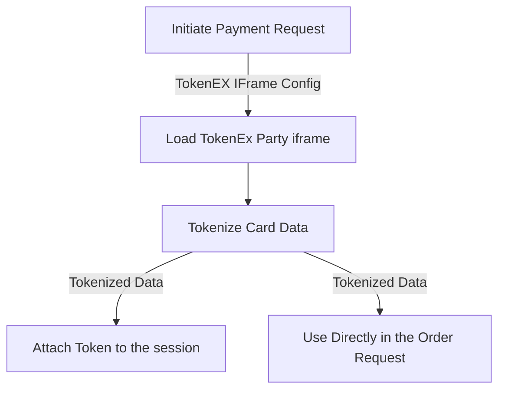

# Payment Overview

ORX uses [TokenEx](https://www.tokenex.com/) to tokenize credit card information. This allows ORX to collect sensitive credit card information without having to store it.

To pass the payment information securely to ORX, start by collecting credit card details through a [payment initialization](#initiate-payment). Then, configure your [TokenEx iFrame](https://docs.tokenex.com/docs/iframe-new) iFrame using the `authentication_key` and `client_id` returned from the initialize endpoint. The iFrame will generate a tokenized version of the credit card data. This token, along with the card type (also provided by TokenEx), billing information, and the cardholder's name, can be used in the [update payment](#update-payment) or [create payment](#create-payment) endpoints to process the payment securely.



# Payment Initialization

Sensitive credit card data is collected using tokenex iFrames, which generate a tokenized version of the card when an order is placed. This tokenized credit card can be used for any future booking requests. In order to generate these iFrames, configuration information must be obtained using the `POST /payment/[sessionId]/initiate` endpoint.

> More information about generating tokenex iFrames can be found in the [tokenex docs](https://docs.tokenex.com/docs/iframe-new).

## Initiate Payment

`POST /payment/[sessionId]/initiate`

This endpoint is used to obtain configuration credentials required to generate tokenex iFrames.

### Payload

```json filename="POST /payment/[sessionId]/initiate" copy
{ "origin": "http://localhost:3000", "token": "411111Z6hasQ1111" }
```

This payload may include the following fields:

- `origin`: The URL of the application embedding the iFrames.

> 🛎 The origin used will have to be whitelisted in production. Please contact our support team for assistance.

- `token` : (optional) The tokenized credit card number. This parameter is included when collecting sensitive information (e.g CVC/CVV) for an already tokenized credit card.

### Response

```json filename="POST /payment/[sessionId]/initiate" copy
{
  "authentication_key": "fBQRtlK5E1SBWJytXMSex7VeSPvAhI8w3A4vgxPD6FC=",
  "expires_at": "2023-06-23T18:46:27.036794Z",
  "client_id": "828643986532625",
  "timestamp": "20230623182627"
}
```

These values are required to create a tokenex [iFrame configuration object](https://docs.tokenex.com/docs/building-the-configuration-object).

- `authentication_key`: This key serves as the `authenticationKey` in the configuration object.
- `client_id`: This id serves as the `tokenExID` in the configuration object.
- `timestamp`: This serves as the `timestamp` in the configuration object.
- `expires_at`: Expiry time of the tokenex iFrame. This is not included in the tokenex configuration object.

### Possible Errors

| Status Code | Error | Reason |
|---|---|---|
| 400 | [Validation Error] | Failed Validation |
| 500 | NDCx Internal Error | Unknown |
| 400 | Unauthorized origin | The requested origin has not been whitelisted. | 

# Payment Management

You can create/update a payment for a specific session. This is useful if you want to progressively update the payment information for a session, prior to performing an order.

> 🧨 The endpoint requires a payment object, including a TokenEx token which has been tokenized [CVV/CVC attached to it](/versions/v2/payment/initiate).

> 🛎 Currently, only a single payment object can be added to each session. Having multiple forms of payment will be supported in the future.

## Update Payment

`PUT /payment/[sessionId]/[paymentId?]`

Use this endpoint to update the payment information for a specific session. Since having multiple forms of payment is not yet supported, the `paymentId` is optional. If no `paymentId` is provided, the payment information will be updated for the session's current payment.

**If the session does not yet have a payment, a new payment will be created.**

### Payload

```json filename="PUT /payment/[sessionId]/[paymentId?]" copy
{
  "code": "visa",
  "first_name": "John",
  "last_name": "Doe",
  "token": "401299Hb1tTS9999",
  "expiry": "10/25",
  "billing_information": {
    "unit": "211",
    "country": "CA",
    "state": "ON",
    "address": "529 West Broadway",
    "city": "Toronto",
    "postal_code": "L5W1N6"
  }
}
```

The payload needs to be of type [payment information](/versions/v2/glossary#payment-information).

> 🛎 You do not need to send the payment information all at once. You can do it in multiple separate calls. You will not receive a validation error if you do not send all the required fields.

### Response

The updated properties will be reflected in the response of type [payment information](/versions/v2/glossary#payment-information).

### Possible Errors

| Status Code | Error | Reason |
|---|---|---|
| 400 | [Validation Error] | Failed Validation |
| 404 | Session not found or expired | Request targeting a non-existent session. |

## Get Payments

`GET /payment/[sessionId]`

Retrieves all of the the payment information objects for a specific session.

### Response

The response will be an array of [payment information](/versions/v2/glossary#payment-information) objects.

### Possible Errors

| Status Code | Error | Reason |
|---|---|---|
| 404 | Payment information not found or expired | There are no payments attached to the given session. |
| 404 | Session not found or expired | Request targeting a non-existent session. |

## Get a Single Payment

`GET /payment/[sessionId]/[paymentId]`

Retrieves a specific payment information object for a specific session.

### Response

The response will be a [payment information](/versions/v2/glossary#payment-information) object.

### Possible Errors

| Status Code | Error | Reason |
|---|---|---|
| 404 | Payment information not found or expired | Payment referenced does not exist. |
| 404 | Session not found or expired | Request targeting a non-existent session. |

## Create Payment

`POST /payment/[sessionId]`

Use this endpoint to create a payment for a specific session. Since having multiple forms of payment is not yet supported, you could use the [update payment](/versions/v2/payment/management#update-payment) endpoint to create and update a singular payment.

### Request

```json filename="PUT /payment/[sessionId]/[paymentId?]" copy
{
  "code": "visa",
  "first_name": "John",
  "last_name": "Doe",
  "token": "401299Hb1tTS9999",
  "expiry": "10/25",
  "billing_information": {
    "unit": "211",
    "country": "CA",
    "state": "ON",
    "address": "529 West Broadway",
    "city": "Toronto",
    "postal_code": "L5W1N6"
  }
}
```

The payload needs to be of type [payment information](/versions/v2/glossary#payment-information).

> 🛎 You do not need to send the payment information all at once. You can do it in multiple separate calls. You will not receive a validation error if you do not send all the required fields.

### Response

The response will contain the created payment [payment information](/versions/v2/glossary#payment-information).

## Delete Payment

`DELETE /payment/[sessionId]/[paymentId]`

### Response

If successful, the response will be empty with a status code of `204`.

### Possible Errors

| Status Code | Error | Reason |
|---|---|---|
| 404 | | Payment referenced was not found. |


# Alternative Payments

You may also pay for orders using alternative payment methods. Currently the only supported alternative payment method is [Verto](https://ver.to/). While all alternative payment methods will use the same set of endpoint, each payment method will have its own payload schema.
Just like regular payments, alternative payments may be attached to a session before making an order, or directly in the order request. Prior to processing an order, the provided alternative payment will be validated and verified. If the payment is not valid, the order will not be created. 

> 🧨 Each session may only have a single regular `payment` or a single `alternativePayment`, but not more. If you attempt to provide more using one of the endpoints, or using the order endpoint, you will receive an error.

## Alternative Payment Management

Below we will outline the endpoints for managing alternative payments. These endpoints can be used for CRUD operations on alternative payments.

## Update Alternative Payment

`PUT /alternative-payment/[sessionId]/[alternativePaymentId?]`

Use this endpoint to update the alternative payment information for a specific session. Since having multiple forms of payment is not yet supported, the `alternativePaymentId` is optional. If no `alternativePaymentId` is provided, the alternative payment information will be updated for the session's current alternative payment.

**If the session does not yet have an alternative payment, a new one will be created.**

### Payload

```json filename="PUT /alternative-payment/[sessionId]/[alternativePaymentId?]" copy
{
  "method": "VERTO",
  "payload": {
    "token" : "f1203b1b-1b1b-1b1b-1b1b-1b1b1b1b1b1b",
  }
}
```

The payload needs to be of type [alternative payment information](/versions/v2/glossary#alternative-payment-information).

> 🛎 You do not need to send the payment information all at once, but you do need to provide the `method` when creating a new alternative payment. 

### Response

The updated properties will be reflected in the response of type [alternative payment information](/versions/v2/glossary#alternative-payment-information).

### Possible Errors

| Status Code | Error | Reason |
|---|---|---|
| 400 | [Validation Error] | Failed Validation |
| 404 | Session not found or expired | Request targeting a non-existent session. |
| 404 | Alternative payment information not found | Request contained an `alternativePaymentId` that does not exist |
| 409 | A payment is already attached to session. Multiple payments are not supported. | There is an existing payment attached to the session. You may only attach a `payment` or an `alternativePayment` to a session. |

## Get Alternative Payments

`GET /alternative-payment/[sessionId]`

Retrieves all of the alternative payment information objects for a specific session.

### Response

The response will be an array of [alternative payment information](/versions/v2/glossary#alternative-payment-information) objects.

### Possible Errors

| Status Code | Error | Reason |
|---|---|---|
| 404 | Alternative payment information not found | There are no alternative payments attached to the given session. |
| 404 | Session not found or expired | Request targeting a non-existent session. |

## Get a Single Alternative Payment

`GET /alternative-payment/[sessionId]/[alternativePaymentId]`

Retrieves a specific alternative payment information object for a specific session.

### Response

The response will be a [alternative payment information](/versions/v2/glossary#alternative-payment-information) object.

### Possible Errors

| Status Code | Error | Reason |
|---|---|---|
| 404 | Alternative payment information not found | Payment referenced does not exist. |
| 404 | Session not found or expired | Request targeting a non-existent session. |

## Create Alternative Payment

`POST /alternative-payment/[sessionId]`

Use this endpoint to create an alternative payment for a specific session. Since having multiple payment/alternative payment is not yet supported, you could use the [update alternative payment](/versions/v2/payment#update-alternative-payment) endpoint to create and update a singular payment.

### Request

```json filename="POST /alternative-payment/[sessionId]" copy
{
    "method": "VERTO",
    "payload" : {
        "token" : "f1203b1b-1b1b-1b1b-1b1b-1b1b1b1b1b1b"
    }
}
```

The payload needs to be of type [alternative payment information](/versions/v2/glossary#alternative-payment-information).

### Response

The response will contain the created alternative payment [alternative payment information](/versions/v2/glossary#alternative-payment-information).

### Possible Errors

| Status Code | Error | Reason |
|---|---|---|
| 400 | [Validation Error] | Failed Validation |
| 404 | Session not found or expired | Request targeting a non-existent session. |
| 409 | An alternative payment is already attached to session. Multiple alternative payments are not supported. | There is an existing alternative payment attached to the session. |
| 409 | A payment is already attached to session. Multiple payments are not supported. | There is an existing payment attached to the session. You may only attach a `payment` or an `alternativePayment` to a session. |

## Delete Alternative Payment

`DELETE /alternative-payment/[sessionId]/[alternativePaymentId]`

### Response

If successful, the response will be empty with a status code of `204`. If the alternative payment does not exist, the response will be a status code of `404`.

### Possible Errors

| Status Code | Error | Reason |
|---|---|---|
| 404 | | Alternative payment referenced was not found. |

