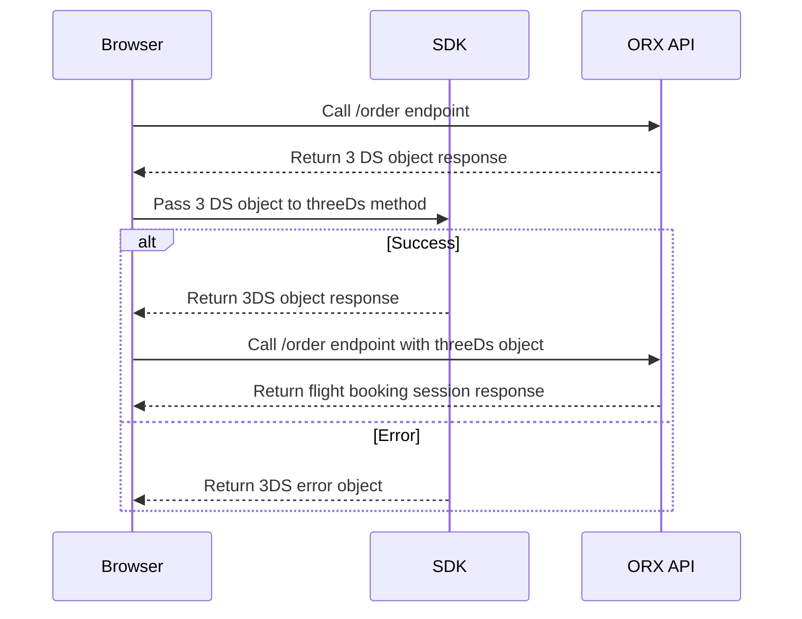

# 3D Secure Overview

3D Secure is a security protocol that provides an additional layer of security against unauthorized use of a credit card.  


The 3D Secure workflow involved opting into the feature using the `three-ds` feature flag. Once passed, the 3D Secure process will be initiated when a payment is made. The 3D Secure process will be initiated when a payment is made. The process will involve the following steps: 



## 3D Secure Trigger

When an endpoint involving a payment is called (e.g. `/flights/[sessionId]/order` endpoint), you might recieve a 3D Secure action object, instead of the usual success response. This object will contain a `action` property set to `three_d_s`. This indicates that you need to pass the response to the `threeDs` function exposed by `@ndcsol/orx`. 

Example of the 3D Secure action object:

```json copy
{
    "gateway": "stripe",
    "payload": {
        "client_secret": "seti_dklsfjlsd12121212",
        "payment_method": "pm_sklj346jdfgn2",
        "publishable_key": "pk_test_sdfsdfsdfsdfklsdfjsdkflsdljflsd"
    },
    "action": "three_d_s"
}
```

You can then pass the 3D Secure object to the `threeDs` method to initiate the 3D Secure process:

```typescript
import { threeDs } from '@ndcsol/orx';

const threeDsResult = await threeDs(
  threeDsObject,
  {
    lcoale: 'en' //optionally may pass a locale to the options object
  }
);

```

## ORX SDK Response

After awaiting the `threeDs` method, the method will respond with either a `success` or an `error` object.

### Successful 3D Secure

If the 3D Secure process is successful, the method will return an object containing a `status` property set to `success`. You can then pass the returned payload to the `/order` endpoint to complete the payment process.


```json copy
{
  "gateway": "stripe",
  "payload": {
    "paymentIntent" : {
      "id": "pi_1J2f3sdf",
      "status": "succeeded"
    }
  },
  "status": "success"
}
```

You can then call the endpoint again, this time passing the returned payload along with the rest of the required parameters.

```json copy
{
  //... other parameters
  "threeDs" : {
    "gateway": "stripe",
    "payload": {
      "paymentIntent" : {
        "id": "pi_1J2f3sdf",
        "status": "succeeded"
      }
    },
    "status": "success"
  }
}
```

### Failed 3D Secure

If the 3D Secure process fails for any reason, the method will return an object containing a `status` property set to `error`. The object might also contain a `message` property that you can use to inform the user of the error.

```json copy
{
  "status": "error",
  "gateway": "stripe",
  "message": "3D Secure authentication failed",
  "error": {
    "message" : "3D Secure authentication failed",
    "code" : "payment_intent_authentication_failure"
  }
}
```

1. Once the promise has resolved, the method will return an object containing a `status` property. If the status is `success`, you may attach the returned payload on a subsequent call to the `/order` endpoint. If the status is `error` a user-readable error may be provided, which you can use to inform the user.


#  Secure
