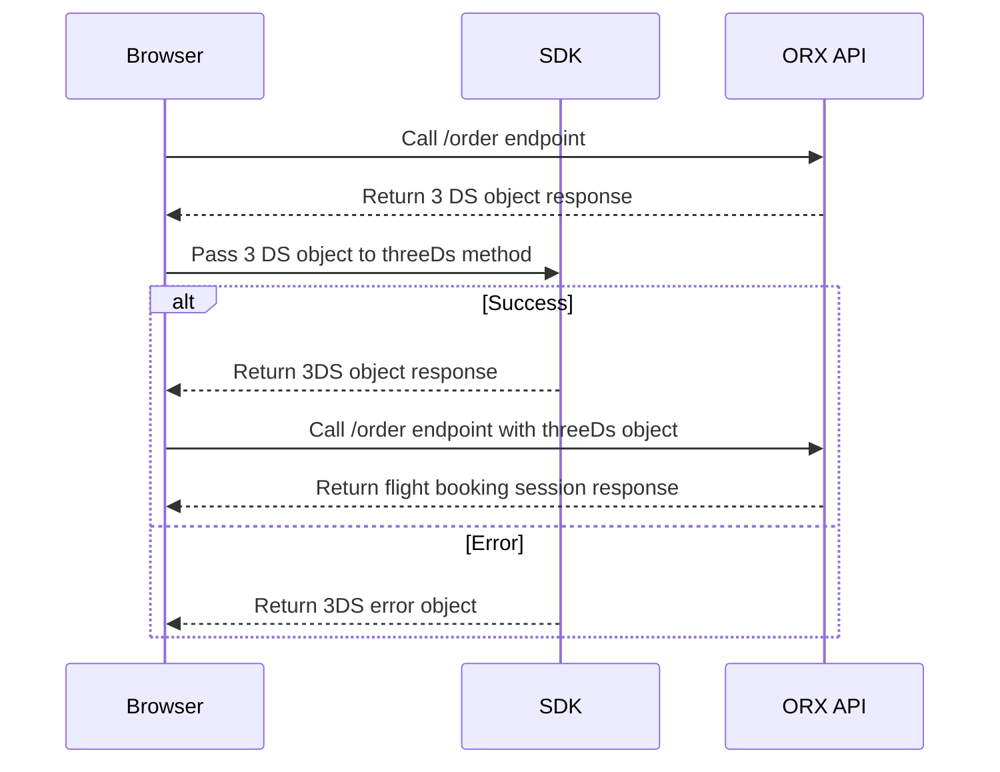

# 3D Secure Overview

3D Secure is a security protocol that provides an additional layer of security against unauthorized use of a credit card.  

# Overview

The 3D Secure workflow involved opting into the feature using the `three-ds` feature flag. Once passed, the 3D Secure process will be initiated when a payment is made. The 3D Secure process will be initiated when a payment is made. The process will involve the following steps: 

1. When the `/order` endpoint is called, if 3D Secure is required, the API will respond with a `3D Secure` response, as opposed to the success order success response. The 3D Secure response will contain a `action` property that's set to `three_d_s`, indicating that a 3D Secure process is required.

1. You will then need to pass the returned response to the `threeDs` method exposed by `@ndcsol/orx`. This method is an async method that needs to be awaited. While the promise is pending, the user might be shown a modal. 

1. Once the promise has resolved, the method will return an object containing a `status` property. If the status is `success`, you may attach the returned payload on a subsequent call to the `/order` endpoint. If the status is `error` a user-readable error may be provided, which you can use to inform the user.

