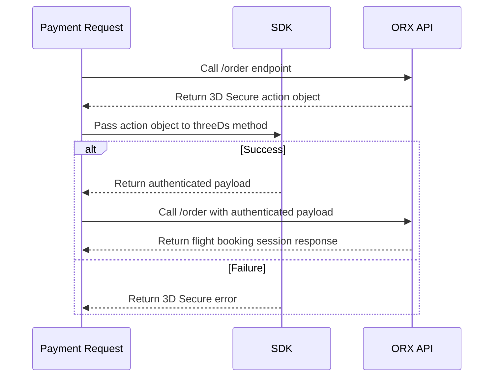

# Fraud Prevention

## Loading the SDK

The following content assumes that the [Browser SDK](/versions/v4/sdk) is configured and loaded. 

## Context Creation

The `createContext` method is used to generate a context object that should be included in the `context` property of the order endpoint. It returns a context object containing information necessary for fraud prevention.


To create a context object, call the `createContext` method on the ORX instance.

```ts
const context = instance.createContext();
```

The `context` object should then be included in the order request to enhance fraud prevention measures.

### Successful Context Creation
```json
{
    "gateway": "stripe",
    "status": "success",
    "payload": {
        "radarSession": {
            "id": "rse_1RMZ41KO2Vs5OgwIcWS8C7oA",
            "passive_captcha_site_key": "9883b18b-8cd9-4469-b478-05c06d8252d8"
        }
    }
}
```
Include this context object in the `context` property of the order request to improve fraud prevention capabilities.


## 3D Secure Overview

ORX provides 3D Secure authentication to add an extra layer of security against unauthorized credit card use. If 3D Secure authentication is required, ORX will return a 3D Secure action object instead of an immediate success response.

To complete the 3D Secure authentication, pass the returned object to the `threeDs` method in `@ndcsol/orx`, which will handle the authentication flow. Once successfully authenticated, the returned payload can be included in the order request to complete the payment.



## 3D Secure Trigger

3D Secure authentication may be required when calling a payment-related endpoint, such as `POST /flights/[sessionId]/order`. If required, the response will include an `action` property set to `three_d_s`, along with authentication details.

When a payment requires 3D Secure authentication, the API will return a response containing a 3D Secure action object.

### Response Example

```json filename="POST /flights/[sessionId]/order" copy
{
    "gateway": "stripe",
    "payload": {
        "client_secret": "seti_dklsfjlsd12121212",
        "payment_method": "pm_sklj346jdfgn2",
        "publishable_key": "pk_test_sdfsdfsdfsdfklsdfjsdkflsdljflsd"
    },
    "action": "three_d_s"
}
```

If 3D Secure is presented, the response object will be of type [3D Secure Action](/versions/v4/glossary#3d-secure-action).

### Possible Errors

| status code | error | reason | reason code |
|---|---|---|---|
| 400 | [validation error] | failed validation | orx_validation_exception |
| 400 | authentication failure | 3d secure authentication failed. | |
| 400 | payment authorization failed when confirming a successful 3ds | payment authorization failed. could not find a successful authorization attempt. | orx_payment_authorization_failed |
| 400 | payment authorization failed when triggering 3ds | payment authorization failed. the payment intent was not successful. | orx_payment_authorization_failed |


## ORX SDK Authentication


To proceed with 3D Secure authentication, pass this object to the `threeDs` function of the ORX instance.

```ts copy
const threeDsResult = await instance.threeDs(threeDsActionObject);
```

After passing the 3D Secure action object to the `threeDs` method, the function will return either a success or an error response.

### Successful Authentication

If authentication succeeds, `threeDs` will return an object with a `status` of `success`. The returned payload should be included in the next order request to complete the payment.

```json copy
{
  "gateway": "stripe",
  
    "paymentIntent" : {
      "id": "pi_1J2f3sdf",
      "status": "succeeded"
    }
  },
  "status": "success"
}
```

Upon success, the response object will be of type [3d secure success](/versions/v4/glossary#3d-secure-success).


Include this payload in the next request:

```json filename="POST /flights/[sessionId]/order" copy
{
  //... other parameters
  "threeDs" : {
    "gateway": "stripe",
    "payload": {
      "paymentIntent" : {
        "id": "pi_1J2f3sdf",
        "status": "succeeded"
      }
    },
    "status": "success"
  }
}
```

### Failed Authentication

If authentication fails, `threeDs` will return an object with a `status` of `"error"`. This object may include an error message detailing the issue.

```json copy
{
  "status": "error",
  "gateway": "stripe",
  "message": "3D Secure authentication failed",
  "error": {
    "message" : "3D Secure authentication failed",
    "code" : "payment_intent_authentication_failure"
  }
}
```

The response object will be of type [3d secure failure](/versions/v4/glossary#3d-secure-failure).


### Example

You can find a minimal example of how to use the `threeDs` method, where you can paste the 3D Secure action object and recieve a 3D Secure success and/or failure objects [here](https://gist.github.com/parsasi/0f3634c8df62c974ce50cb9eda5c5682).
